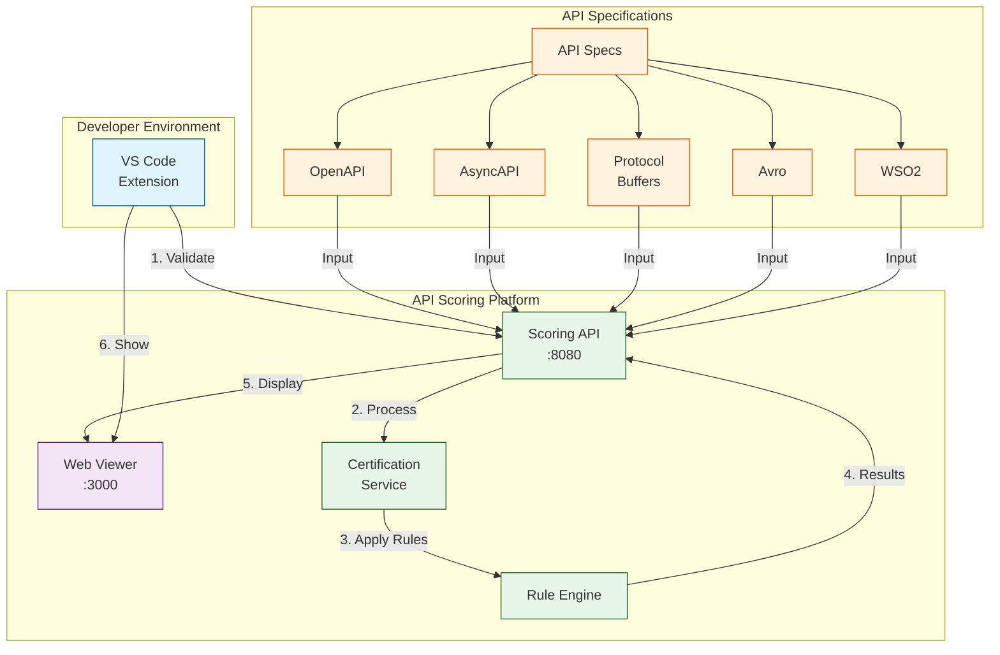

# API Scoring Extension - Ecosystem


This repository is a fork of [InditexTech's API Scoring IDE Plugins](https://github.com/InditexTech/api-scoring-ide-plugins), enhanced with additional features and improvements. While the original project provides a robust foundation for API validation, this fork extends its capabilities to better support enterprise use cases.

## What's New in This Fork

1. **WSO2 API Analysis**: Added support for analyzing WSO2 API export ZIP files, making it easier to validate APIs exported from WSO2 API Manager.
2. **Spider Chart Visualization**: Introduced a new spider/radar chart representation to visualize API scoring metrics, providing a more intuitive way to understand API quality across different dimensions.

## About the Project

The API Scoring Extension is a comprehensive tool suite designed to evaluate and improve the quality of your APIs. It automatically analyzes API specifications against industry best practices, security standards, and documentation requirements, providing detailed feedback and scoring metrics to help developers create better APIs.

## Key Features

- **Automated API Analysis**: Validates APIs against predefined rulesets for design, security, and documentation
- **Multiple Format Support**: Handles OpenAPI, AsyncAPI, Protocol Buffers, Avro schemas, and WSO2 API exports
- **Real-time Validation**: Integrates with VS Code to provide immediate feedback during development
- **Visual Scoring**: Spider/radar chart visualization of API quality metrics across different dimensions
- **Detailed Reports**: Comprehensive analysis with specific recommendations for improvement
- **WSO2 Integration**: Direct support for WSO2 API Manager exports

The ecosystem contains all necessary components to run the complete API Scoring platform, including the backend service, frontend viewer, and IDE extensions.

## 🏛️ Architecture

The following diagram shows how the different components of the API Scoring Extension ecosystem interact with each other:



The architecture consists of:
- **VS Code Extension**: Provides IDE integration for real-time API validation
- **Frontend SPA**: Web interface for viewing detailed scoring results and recommendations
- **Backend Services**: 
  - Scoring API: Main entry point for API analysis
  - Certification Service: Handles API validation and scoring
  - Ruleset Engine: Applies design, security, and documentation rules
- **Input Sources**: Supports multiple API specification formats including OpenAPI, AsyncAPI, Protocol Buffers, and Avro Schema

## 🚀 Quick Start

```bash
# Start the entire ecosystem
./start-ecosystem.sh

# Stop the entire ecosystem
./stop-ecosystem.sh

# Check ecosystem status
./status.sh
```

## 🏗️ Project Structure

```
ecosystem/
├── start-ecosystem.sh    # Main script to start the ecosystem
├── stop-ecosystem.sh     # Main script to stop the ecosystem
├── status.sh            # Script to check ecosystem status
├── README.md            # This file
└── ECOSYSTEM-README.md  # Detailed ecosystem documentation
```

## 🔧 Components

The ecosystem includes:

1. **Backend API** (port 8080)
   - API certification and scoring service
   - Main endpoint: `http://localhost:8080/apifirst/v1`
   - Health check: `http://localhost:8080/health`

2. **Frontend SPA** (port 3001)
   - Web interface for viewing results
   - URL: `http://localhost:3001`
   - Interactive scoring visualization

3. **VS Code Extension**
   - Integrates with VS Code/Cursor
   - Automatically installed during startup
   - Provides real-time API validation

## 📋 Usage Examples

### 1. Basic API Validation

Create a project with the following structure:
```
my-api-project/
├── metadata.yml
└── openapi-rest.yml
```

Example `metadata.yml`:
```yaml
apis:
  - name: "My REST API"
    version: "1.0.1"
    description: "Sample API for demonstration"
    definition-path: "openapi-rest.yml"
    api-spec-type: "REST"
```

### 2. Using the VS Code Extension

1. Open your API project in VS Code:
```bash
cd my-api-project
code .
```

2. Press `Cmd+Shift+P` (Mac) or `Ctrl+Shift+P` (Windows/Linux)
3. Type and select: "APIScoring: Validate local APIs & Open APIScoring Application"
4. View your API score and recommendations in the new tab

### 3. Using the CLI

```bash
# Install the CLI
npm install -g @inditex/api-cli

# Verify an API specification
apicli verify-file openapi-rest.yml

# Get full API scoring report
apicli verify
```

### 4. Working with WSO2 APIs

Place your WSO2 API archive in the project:
```
my-api-project/
└── admin-PizzaShackAPI-1.0.0.zip
```

The extension will automatically detect and analyze the API.

## 🛠️ Services

- **Podman**: For container orchestration and services
- **VS Code CLI**: For extension installation
- **Health Checks**: Automatic service verification
- **Logs**: Container log visualization

## ⚠️ Troubleshooting

### Check Service Status
```bash
# View active containers
podman ps --filter "name=api-scoring"

# View frontend logs
podman logs -f api-scoring-frontend

# View backend logs
podman logs -f api-scoring-engine_scoring-api_1
```

### Complete Cleanup
```bash
# Stop and remove all containers
podman rm -f $(podman ps -aq --filter 'name=api-scoring')

# Remove images
podman rmi $(podman images --filter 'reference=*api-scoring*' -q)

# Remove volumes
podman volume prune -f

# Uninstall VS Code extension
code --uninstall-extension inditextech.apiscoring
```

## 📝 Prerequisites

- Podman installed and running
- VS Code CLI installed (optional, for automatic extension installation)
- Ports 3001 and 8080 available

## 📚 Additional Resources

- [Detailed Ecosystem Documentation](ECOSYSTEM-README.md)
- [API Scoring Documentation](https://inditextech.github.io/api-scoring-doc/)
- [CLI Documentation](https://inditextech.github.io/api-scoring-doc/scoring-system/cli/)
- [VS Code Extension Guide](https://inditextech.github.io/api-scoring-doc/ide-extensions/overview/)